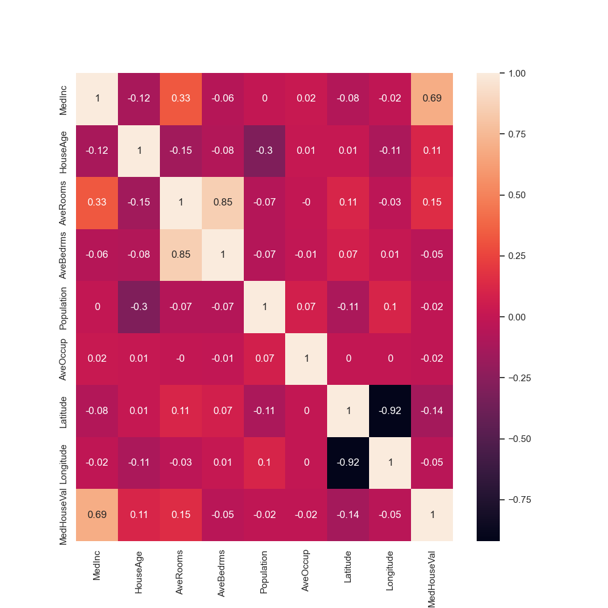

# California Housing Price Prediction

This project aims to predict housing prices in California using the California Housing dataset from the UCI Machine Learning Repository. The dataset is also included in the scikit-learn library, making it easy to load and use for experimentation.

## Dataset

The California Housing dataset consists of 20640 samples with 8 features and a target column (MedHouseVal). The features are:

1. MedInc: median income in block
2. HouseAge: median house age in block
3. AveRooms: average number of rooms
4. AveBedrms: average number of bedrooms
5. Population: block population
6. AveOccup: average house occupancy
7. Latitude: house block latitude
8. Longitude: house block longitude

The target column, MedHouseVal, represents the median house value for California districts.

## Requirements

- Python 3.7+
- pandas
- numpy
- seaborn
- matplotlib
- scikit-learn

## Usage

1. Load the dataset using the scikit-learn library.
2. Perform exploratory data analysis (EDA) using correlation heatmaps.
3. Select features and split the data into training and testing sets.
4. Train a linear regression model on the training set.
5. Make predictions using the test set and evaluate the model's performance.
6. Visualize the predicted prices against the actual prices.

## Results

The performance of the linear regression model can be assessed using metrics such as mean squared error, root mean squared error, and R-squared score. The predicted prices can be visualized against the actual prices using a scatter plot.
